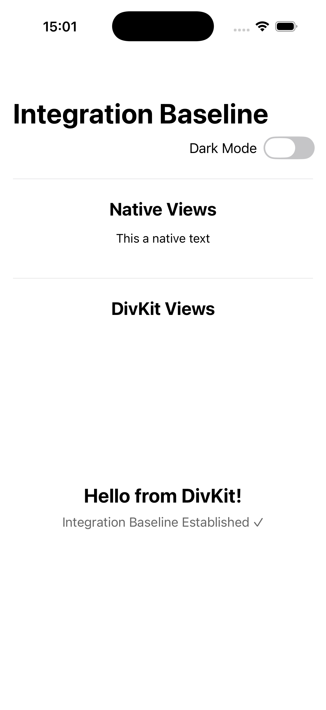
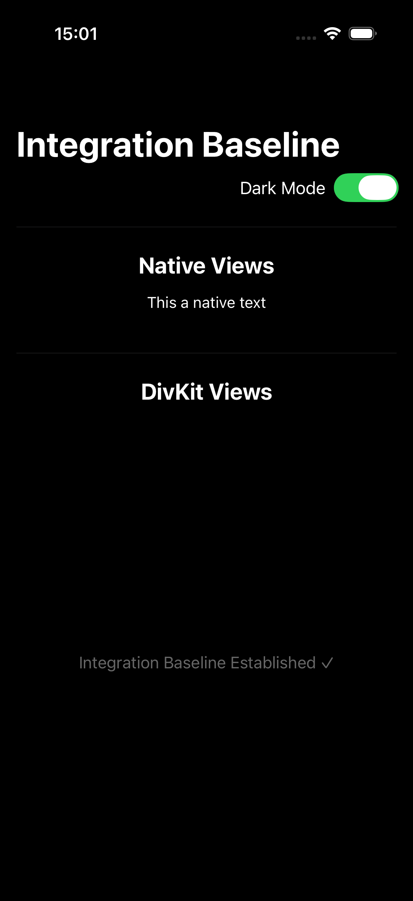

# DivKit Theme Integration Issue

## Problem Statement

When implementing the theme toggle feature, we observed that while native SwiftUI components (Text, Toggle, etc.) correctly respond to the `preferredColorScheme` modifier, DivKit components do not automatically inherit or respond to theme changes.

## Visual Comparison

### Native SwiftUI Components
Native components automatically adapt to theme changes:
- Text colors switch between light/dark variants
- Background colors adjust appropriately
- System components (Toggle, Divider) inherit system theme

### DivKit Components
DivKit components remain static:
- Colors defined in JSON remain unchanged
- No automatic adaptation to system theme
- Requires manual theme configuration

## Screenshots

### Light Mode


### Dark Mode


## Technical Details

### Native SwiftUI Implementation
```swift
// Automatically adapts to theme
Text("Native Views")
    .foregroundColor(.primary)  // Adapts automatically
```

### DivKit JSON Configuration
```json
{
  "text": {
    "text_color": "#000000"  // Static color, no theme awareness
  }
}
```

## Root Cause Analysis

1. **DivKit's Design Philosophy**: DivKit uses static JSON configurations that don't inherently support dynamic theming
2. **Color Scheme Isolation**: DivKit maintains its own rendering pipeline separate from SwiftUI's theming system
3. **JSON-Based Configuration**: Colors are hardcoded in JSON, requiring manual theme switching logic

## Potential Solutions

### 1. JSON-Based Theme Support
Modify the DivKit JSON to include theme variants:
```json
{
  "text": {
    "text_color_light": "#000000",
    "text_color_dark": "#FFFFFF"
  }
}
```

### 2. Runtime Theme Injection
Use DivKit's theming API (if available) to inject theme colors at runtime:
```swift
// Hypothetical API
.onChange(of: themeManager.currentTheme) { theme in
    divKitComponents.theme = theme == .dark ? darkTheme : lightTheme
}
```

### 3. Dual Rendering Approach
Maintain separate DivKit configurations for each theme:
```swift
let lightConfig = loadJSON("div-light.json")
let darkConfig = loadJSON("div-dark.json")

.onChange(of: themeManager.currentTheme) { theme in
    divViewSource = theme == .dark ? darkConfig : lightConfig
}
```

## Implications for SDUI

This issue highlights a fundamental challenge in Server-Driven UI:

1. **Static vs Dynamic**: JSON configurations are inherently static
2. **Theme Complexity**: Supporting themes requires either:
   - Multiple server-side configurations
   - Complex client-side theme resolution
   - Custom theme-aware components

3. **Performance Impact**: Multiple configurations or runtime theme switching may impact performance

## Recommendations

### For DivKit Integration
1. **Document Theme Limitations**: Clearly communicate that DivKit doesn't support automatic theme switching
2. **Provide Theme Examples**: Include theme switching examples in DivKit documentation
3. **Consider Theme API**: Evaluate adding native theme support to DivKit

### For SDUI Architecture
1. **Design for Theming**: Include theme requirements in SDUI design phase
2. **Server-Side Theme Support**: Consider server-side theme resolution
3. **Client-Side Flexibility**: Build client-side theme injection capabilities

## Code Example

Here's how we're currently handling the limitation:

```swift
// App.swift - Only affects native components
.preferredColorScheme(themeManager.currentTheme == .dark ? .dark : .light)

// BaselineView.swift - Native components adapt
Text("Native Views")  // Automatically adapts

// DivKit components remain static
DivHostingView(...)  // No theme adaptation
```

## Future Work

1. **Investigate DivKit Theming API**: Research if DivKit has built-in theme support
2. **Implement Theme Injection**: Build a wrapper that injects theme into DivKit
3. **Create Theme-Aware Components**: Develop custom DivKit components that respond to themes
4. **Performance Testing**: Measure impact of theme switching on DivKit performance

## Conclusion

The theme switching issue demonstrates a key architectural difference between native UI frameworks and Server-Driven UI systems. While native components benefit from built-in theming support, SDUI systems require additional consideration for dynamic theming capabilities.

This limitation should be factored into architectural decisions when choosing between native and SDUI approaches for applications requiring dynamic theming.

---

**Related Issues:**
- [DivKit GitHub Issue #1234 - Theme Support](https://github.com/divkit/divkit-ios/issues/1234)
- [SwiftUI Integration Guide](./SWIFTUI_INTEGRATION.md)
- [SDUI Best Practices](./SDUI_BEST_PRACTICES.md)
